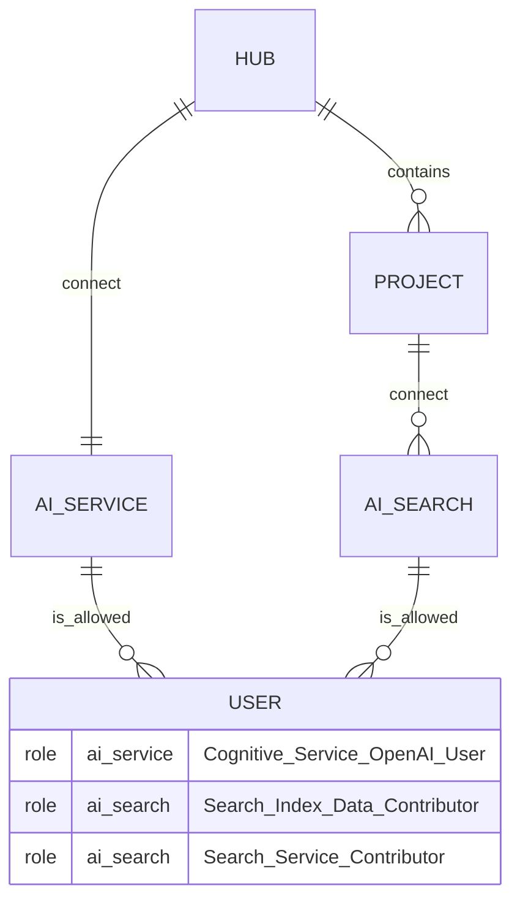

# Azure AI Studio demo of a RAG in python using Terraform for ressource creation

## disclaimer

I try to set all the config to minimal values or even to free tiers when possible, but cost may occurs (that's how cloud works).  
Destroy all the ressources as soon as you are done with them.  
This is a WIP (see todo section)

## what is created


## running
you need an azure account
in Powershell or in bash set your environement with:
- Azure Cli
- Terraform

note: I use a fairly new version of azurerm (4.2). Azure documentation ytd use 3.0, this may leads to incompatibility.

Connect to your subscription with `az login`.  
get tenant and subscription info with `az account show`.

Add two env vars, for your subscription and tenant:
- ARM_TENANT_ID
- ARM_SUBSCRIPTION_ID

(reminder: $env:VAR=value in PS)

You should be able to run:

```
terraform init -upgrade
terraform plan -out main.tfplan
terraform apply "main.tfplan"
```

And then to be able to use this ressources in a python chat with RAG like described in this tutorial skipping step 1: https://learn.microsoft.com/en-us/azure/ai-studio/tutorials/copilot-sdk-create-resources.  
I plan to add my own simplified code later on.

## troubleshooting

As for september 2024, there is a IAM error on the MSI created for the project. 
It can be overcomed by adding 2 roles, see permisions.tf commented code at the bottom.
This has been fixed since then.


## TODO
- [x] add a diagram
- [x] create code to demonstrate how to migrate from openai to azure openai
- [ ] create simple python rag code instead of default tutorial 
- [ ] add TFstate management 

## ref
Note: documentation is kind of outdated on official azure website, this repo try to be as up-to-date as possible as for September 2024. Anyway here are some starting point that I have adapted:
- [Azure RM 4.2](https://registry.terraform.io/providers/hashicorp/azurerm/latest/docs)
- [AZ AI Studio - create a hub with TF](https://learn.microsoft.com/en-us/azure/ai-studio/how-to/create-hub-terraform?tabs=azure-cli)
- [AZ AI Services](https://learn.microsoft.com/en-us/azure/ai-services/create-account-terraform?tabs=azure-cli)
- [AZ AI Search](https://learn.microsoft.com/en-us/azure/search/search-get-started-terraform)
